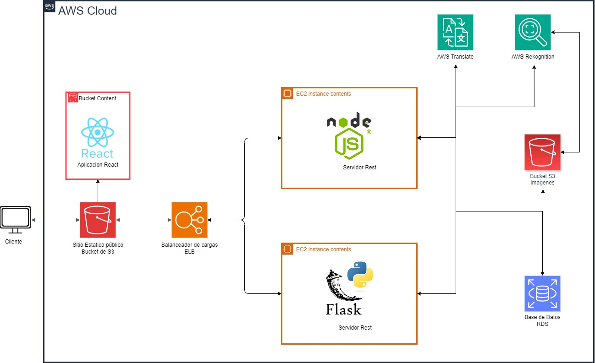
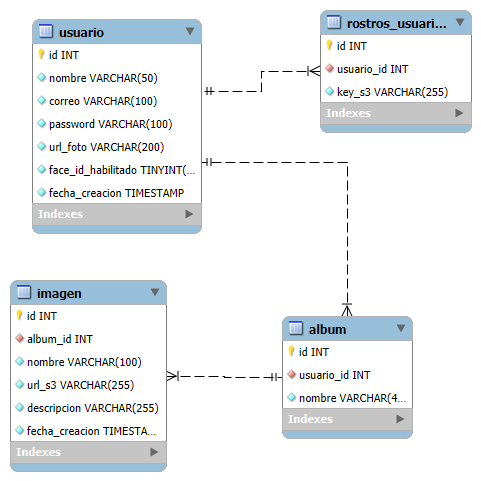
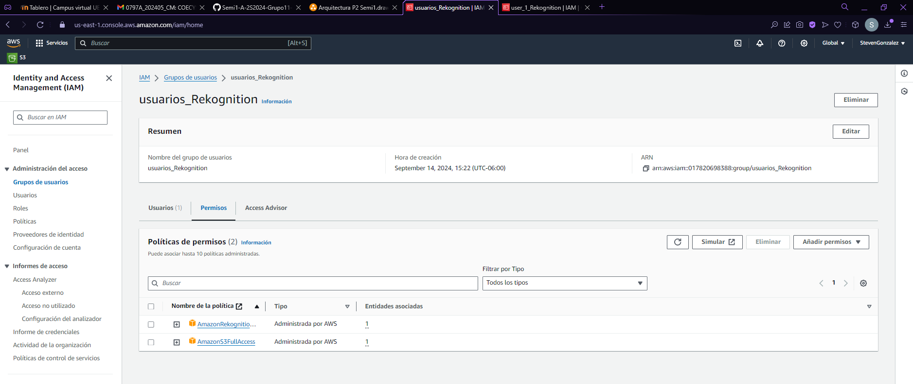

# Practica 2 - Seminario de Sistemas 1

## Grupo 11

| Nombre                                | Carnet  |
|---------------------------------------|---------|
|Steven Josue González Monroy           |201903974|
| Hugo Jorge Luis Pérez Arana           |201504070|
| Luis Fernando Falla Guzmán            |201700700|
| Christian Alessander Blanco González  |202000173|

## Arquitectura

Esta arquitectura está desplegada en AWS Cloud diseñada para manejar solicitudes simultáneamente desde el frontend alojado en un bucket de S3, distribuyendo el tráfico con un Load Balancer entre los servidores backend desplegados en instancias de EC2, asegurando que la aplicación web pueda atender a varios usuarios al mismo tiempo y el rendimiento sea óptimo. Esta arquitectura garantiza alta disponibilidad, escalabilidad y seguridad.

La arquitectura consiste en varias capas, mediante el siguiente flujo con la solicitud desde el cliente hasta la base de datos o almacenamiento en la nube.

* El cliente desea realizar una acción en la aplicación.
* El frontend hace una solicitud, la envía al balanceador de carga.
* El balanceador de carga recibe la solicitud y la distribuye a uno de los servidores disponibles.
* Backend porcesa la solicitud y envia una petición al servicio de Rekognition o Translate, segun sea la acción.
* El Backend escribe la información en la base de datos u obtiene información de la misma.
* El backend envía la respuesta al balanceador de carga.
* El balanceador dirige la respuesta al frontend.
* Se muestra la información al usuario en el frontend.

### Iniciar Frontend
    npm i
    npm start

### Iniciar Backend

    backend-node:
        npm i
        npm start

    backend-python:
        python3 -m venv .venv
        source .venv/bin/activate
        pip install -r requirements.txt
        flask run --debug

### ENVS:
    HOST
    DATABASE
    PORT
    USERDATAB
    PASSWORD
    ACCESS_KEY_ID
    SECRET_ACCESS_KEY
    REGION
    BUCKET
    REKOGNITION_ACCESS_KEY_ID
    REKOGNITION_SECRET_ACCESS_KEY
    REKOGNITION_REGION

### Diagrama ER

* Descripción: Este Diagrama representa de forma gráfica las principales entidades dentro del sistema y las relaciones entre ellas. Este modelo se utilizó para estructurar y organizar la base de datos, permitiendo comprender como interactúan los datos y se relacionan. 

El diagrama adjunto muestra las principales entidades del sistema y cómo están relacionadas. 

Entidades:

* **usuario** representa un perfil único.
* **rostros_usuario** representa la imagen registrada en S3 para reconocimiento facial.
* **album** representa los albumes en donde el usuario guardará imagenes.
* **imagen** representa las imagenes que el usuario sube y seran almacenadas en el bucket de S3, tanto fotos de perfil como otras imagenes.

Relaciones:

* Las líneas que conectan las entidades indican las relaciones, con la cardinalidad especifica (1 - 1:N). 
* Las llaves primarias se destacan con una llave amarilla.
* Las claves foráneas se destacan por la relación (1:N) en cada entidad donde corresponda. 

## Usuarios IAM y políticas asociadas

#### **Administrador-Seminario1**: 
Este usuario tiene acceso total a todos los recursos y servicios de AWS permite una gestión completa del entorno.

* **Política asociada**: AdministratorAccess

#### S3
* **Usuario-S3**: El usuario S3 esta dedicado a la gestion y acceso completo a los buckets y objetos almacenados en Amazon S3

* **Política asociada**: AmazonS3FullAccess

#### EC2
*  **Backend**: El usuario backend tiene acceso completo a los recursos de EC2 es utilizado principalmente para lanzar instancias y configurar balanceadores de carga ELB.

* **Política asociada**: AmazonEC2FullAccess , ElasticLoadBalancingFullAccess.

#### RDS

 * **Usuario-RDS**: Es el usuario encargado de la gestión total de las bases de datos relacionales en Amazon RDS en este caso en la creación de una base de datos MYSQL.
    * **Política asociada**: AmazonRDSFullAccess

    

#### Rekognition

* **Usuario-Rekognition**: Es el usuario con el cual se generan la access keys para poder utilizar rekognition desde el SDK. Se otorgan tambien permisos de S3 ya que debe de comparar rostros de imagenes dentro del bucket de s3, asi como el analisis de etiquetas.

* **Política asociada**: AmazonRekognitionFullAccess , AmazonS3FullAccess

## Configuración de cada servicio

### S3

* Descripción: Amazon S3 (Simple Storage Service) es un servicio de almacenamiento en la nube que permite guardar y recuperar cualquier cantidad de datos en cualquier momento y desde cualquier lugar.
* Configuración: Definir nombre de bucket
    * **sound-stream-semi1-seccion-g11 (Sitio web estático)**

    

    * **practica2-semi1-a-2s2024-imagenes-g11 (Multimedia)**

    
    
    * **Bucket público**

        

        

### EC2

* Descripción: Amazon EC2 (Elastic Compute Cloud) es un servicio que proporciona capacidad de cómputo en la nube de manera escalable. Permite lanzar y administrar instancias de servidores virtuales, ofreciendo control de infraestructura, desde selección del sistema operativo hasta la configuración de la red, facilitando la ejecución de aplicaciones y servicios en la nube.
* Configuración: 
    * **backend-node**

        **Definir nombre**

        

        **Definir AMI**

        

        **Crear llaves de acceso SSH**

        

        **Seleccionar llaves de acceso**

        

        **Seleccionar grupo de seguridad**

        

    * **backend-python**

        **Definir nombre**

        

        **Definir AMI**

        

        **Crear llaves de acceso SSH**

        

        **Seleccionar llaves de acceso y grupo de seguridad**

                

### Balanceador de carga

* Descripción: El Balanceador de Carga (Elastic Load Balancer - ELB) en AWS distribuye automáticamente el tráfico de red o de aplicación entrante entre múltiples instancias de EC2, mejorando la disponibilidad y tolerancia a fallos de las aplicaciones.
* Configuración: 
    **Definir tipo**

    

    **Definir nombre**

    

    **Seleccionar grupo de seguridad y definir agente de escucha**

    

    **Comprobación de estado**

    

    **Seleccionar instancias**

    

    **Verificar resumen y crear**

    

### RDS

* Descripción: Amazon RDS (Relational Database Service) es un servicio gestionado que facilita la configuración, operación y escalado de bases de datos relacionales en la nube. Soporta varias bases de datos como MySQL, PostgreSQL, Oracle, y SQL Server.
* Configuración: 
    **Seleccionar método de creación y motor**

     

    **Seleccionar versión del motor de base de datos**

     

    **Seleccionar plantilla**

     

    **Definir identificador de la instancia RDS y credenciales**

     

    **Seleccionar clase de instancia**

     

    **Definir tipo de almacenamiento y capacidad**

     

    **Seleccionar grupo de seguridad**

     

    **Seleccionar autenticación a la base de datos**
    
     